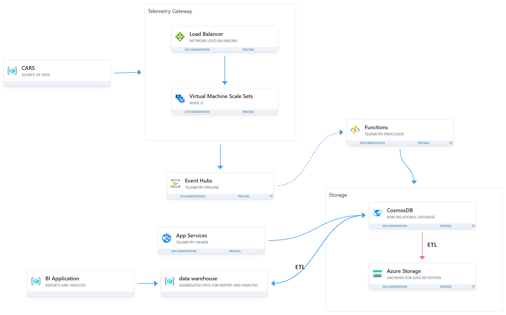

# Case Study - Telemetry Car System

## Overview

A company that manufactures autonomous systems for vehicles needs a new computer system to reliably receive telemetry from cars and display data about them.

**Current Scale:**
- 10,000+ vehicles on the roads
- Expected to grow to 200,000+ vehicles by end of year

---

## Functional Requirements

**Web-based system** with the following capabilities:

### Telemetry Collection
- Receive telemetry data from cars (location, speed, breakdowns, etc.)

### Data Storage
- Store telemetry in a persistent data store

### Data Visualization
- Display dashboards summarizing the data

### Data Analysis
- Perform analysis on the collected telemetry data

---

## Non-Functional Requirements

### System Characteristics
- **Data intensive system**: Large volume of incoming data
- **User base**: Not a lot of users (mainly data analysts)
- **Data volume**: Very large amount of data
- **Performance**: Real-time data processing required (no stale data)

### Technical Specifications
- **Message throughput**: 7,000 messages per second
- **Operational database size**: Maximum 4TB
- **Data retention**: Must define retention period to prevent database from growing infinitely and maintain query performance

### Data Characteristics (from customer)
- **Message schema**: Schema-less (no definite structure, messages can differ from each other)
- **Message loss tolerance**: Some message loss is acceptable

---

## Key Considerations

### Data Retention
- Defines how long records are kept in the database
- Prevents database from exploding in size
- Improves query performance by limiting data volume

---

## Architecture Reasoning

### Load Balancer + VM Scale Sets
- Handle incoming telemetry traffic from vehicles
- Distributes requests evenly across multiple servers
- Allows horizontal scaling as the number of cars increases from 10K to 200K+

### Event Hubs
- Acts as the ingestion layer for high-throughput telemetry data
- Can handle thousands of messages per second (meets 7K messages/sec requirement)
- Decouples data producers (cars) from downstream processing
- Buffers incoming messages to prevent data loss during traffic spikes

### Azure Functions (Telemetry Processor)
- Processes incoming telemetry events from Event Hubs
- Scales automatically based on incoming data volume
- Supports near real-time processing without managing servers
- Cost efficient for event-driven workloads

### Cosmos DB
- Stores telemetry data in the operational database
- Supports schema-less data (matches requirement for varying message structures)
- High write throughput for handling 7K messages/sec
- Horizontal scaling for large volumes of incoming data
- Designed for real-time queries and low-latency reads

### Azure Storage (Data Retention)
- Used for long-term storage of older telemetry data
- Helps reduce load on the operational database
- Controls storage costs by moving cold data to cheaper storage tiers
- Supports data retention strategy to keep operational DB under 4TB limit

### App Services (Telemetry Viewer)
- Displays telemetry dashboards for data analysts
- Provides a simple and scalable way to expose data to users
- Handles small number of users efficiently

### Data Warehouse
- Used for aggregated and analytical queries
- Separates reporting workloads from operational systems
- Improves performance for complex analytics
- Optimized for read-heavy analytical workloads

### ETL Process
- Moves and transforms data from operational storage to the data warehouse
- Ensures data is structured and optimized for reporting and analysis
- Aggregates data for better query performance
- Supports data retention by moving old data out of operational store

### Data Retention Strategy
- Controls database growth to stay within 4TB operational limit
- Keeps only recent data in the operational store (e.g., last 30 days)
- Archives older data to Azure Storage for long-term use
- Improves query performance by limiting active dataset size
- Reduces operational costs by using appropriate storage tiers
